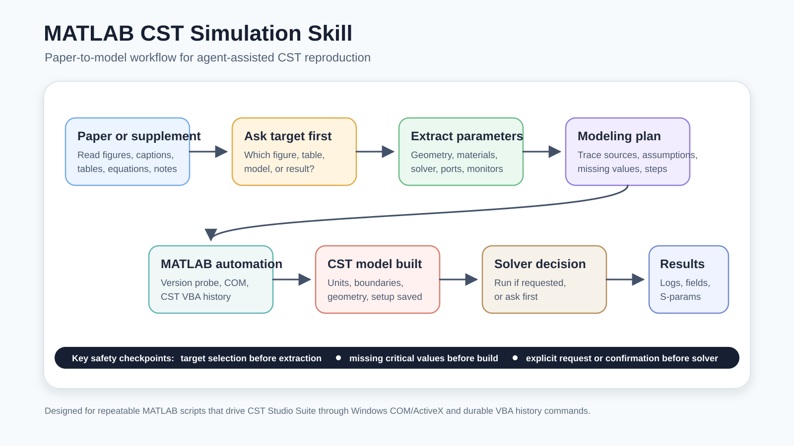
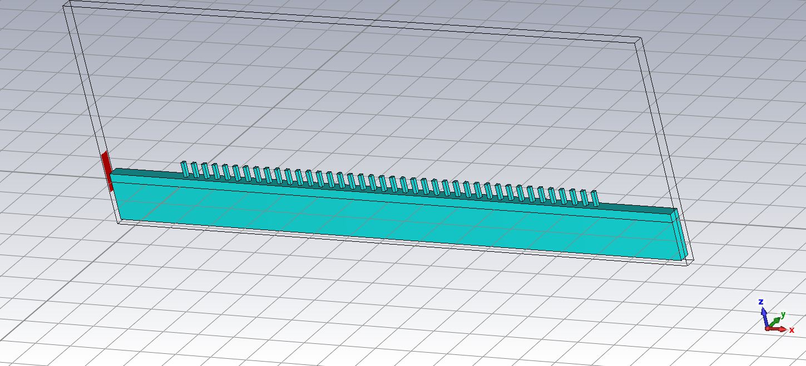

# MATLAB CST Simulation Skill

[简体中文说明](README.zh-CN.md)

[](matlab-cst-simulation/SKILL.md)
[](matlab-cst-simulation/examples)
[](matlab-cst-simulation/references/environment-and-execution.md)



A Codex/agent skill for automating CST Studio Suite simulations from MATLAB.

This repository contains a reusable skill that helps coding agents create, run, inspect, and validate MATLAB scripts that control CST Studio Suite through Windows COM/ActiveX and CST VBA history commands. It is aimed at agent-assisted electromagnetic simulation workflows such as antenna simulation, microwave engineering, periodic structures, FSS/metasurface studies, parameter sweeps, and CST result export.

## Example CST Model



## Quick Start

Install the skill folder into your local Codex skills directory:

```powershell
git clone https://github.com/xixiheni/matlab-cst-simulation-skill.git
Copy-Item -Path .\matlab-cst-simulation-skill\matlab-cst-simulation `
  -Destination "$env:USERPROFILE\.codex\skills\matlab-cst-simulation" `
  -Recurse -Force
```

Then ask Codex or another compatible coding agent:

```text
Use $matlab-cst-simulation to create a MATLAB script that builds a CST patch antenna model, sets ports and monitors, prepares a run script, and asks me before starting the solver.
```

Or start from a paper:

```text
Use $matlab-cst-simulation to read this paper, ask me which figure or model I want to reproduce, extract all CST modeling parameters for that target, write a detailed reproduction plan, ask me for missing critical values, and then build the CST model from the confirmed plan.
```

The skill is intentionally cautious: after modeling and simulation setup are complete, it asks for confirmation before launching a CST solver unless the user already gave explicit run permission.

## What This Skill Helps With

- Create new CST projects from MATLAB.
- Turn a paper or supplementary material into a source-traceable CST modeling plan before coding.
- Open and modify existing `.cst` projects.
- Define units, frequency ranges, materials, geometry, boundaries, excitations, and monitors.
- Prepare and run CST solvers from MATLAB with explicit user confirmation before solver launch.
- Export S-parameters, farfield data, field slices, images, or other result files.
- Inspect CST-generated project files and solver logs.
- Probe MATLAB/CST installation health before debugging generated code.
- Use `TCSTInterface`-style workflows for existing projects and result extraction.
- Generate version-adaptive scripts that probe MATLAB/CST capabilities and fall back to conservative syntax when possible.

## Why Use This Skill

MATLAB-CST automation is powerful but fragile: small differences in CST releases, COM registration, MATLAB string syntax, solver names, boundary spellings, and result tree paths can break otherwise reasonable scripts. This skill gives agents a reusable operating guide for building scripts that are inspectable, repeatable, and honest about version assumptions.

Useful search terms for this repository:

```text
MATLAB CST automation
CST Studio Suite COM
CST Microwave Studio MATLAB
Codex skill MATLAB CST
agent skill electromagnetic simulation
antenna simulation MATLAB CST
ActiveX COM automation CST
```

## Repository Layout

```text
assets/
  workflow.svg
  workflow.png
  example.png
matlab-cst-simulation/
  SKILL.md
  agents/
    openai.yaml
  references/
    environment-and-execution.md
    geometry-vba-patterns.md
    parameter-extraction-template.md
    paper-to-model-workflow.md
    simulation-setup.md
    tcstinterface.md
    version-compatibility.md
    validation.md
  scripts/
    check-cst-project.ps1
    parse-cst-log.ps1
    probe-matlab-cst.ps1
  examples/
    build-basic-plane-wave-project.m
    run-existing-project.m
```

## Requirements

- Windows
- MATLAB
- CST Studio Suite
- CST COM/ActiveX automation registered
- A valid CST license

The skill can still help generate scripts on non-Windows systems, but CST COM automation requires Windows.
It is designed to probe versions and use conservative fallbacks where possible, but exact behavior still depends on the installed MATLAB release, CST release, solver modules, and license features.

## Installation

Copy or install the `matlab-cst-simulation/` folder as a skill in your agent environment.

For Codex-style local skills, place the folder under your skills directory, for example:

```text
~/.codex/skills/matlab-cst-simulation/
```

The required entrypoint is:

```text
matlab-cst-simulation/SKILL.md
```

For Codex skill installation from GitHub, the skill path is:

```text
xixiheni/matlab-cst-simulation-skill
matlab-cst-simulation
```

For API or platform workflows that accept packaged skills, upload the `matlab-cst-simulation/` directory or a zip containing that directory.

## Example Use

```text
Use $matlab-cst-simulation to create a MATLAB script that builds a CST patch antenna model, adds a waveguide port and E-field monitor, runs the solver, and exports S11.
```

```text
Use $matlab-cst-simulation to inspect this existing CST project, change two parameters, run a sweep, and export Touchstone files.
```

```text
Use $matlab-cst-simulation to reproduce Figure 4 from this paper. First write the modeling-steps document, identify missing parameters, then generate the MATLAB/CST build script.
```

## Version Compatibility

The skill does not claim universal compatibility with every MATLAB and CST version. Instead, it uses a version-adaptive strategy:

- Probe MATLAB, CST, COM/ActiveX, project open/save, and solver access before relying on version-sensitive commands.
- Prefer MATLAB char arrays, `sprintf`, and `exist(path, 'file')` in public examples.
- Prefer CST `AddToHistory` VBA command blocks for durable, inspectable model setup.
- Report detected versions, assumptions, failed command blocks, and fallback options.

See [version-compatibility.md](matlab-cst-simulation/references/version-compatibility.md).

Run the environment probe before blaming a generated script:

```powershell
powershell -ExecutionPolicy Bypass -File .\matlab-cst-simulation\scripts\probe-matlab-cst.ps1
```

For paper reproduction, use the source-traceable parameter table in [parameter-extraction-template.md](matlab-cst-simulation/references/parameter-extraction-template.md).

## Release

Current public release target: `v0.1.0`.

Suggested release title:

```text
Initial public release
```

Suggested release summary:

```text
First public release of matlab-cst-simulation, a Codex/agent skill for MATLAB-driven CST Studio Suite automation. Includes project generation guidance, paper-to-model reproduction planning, parameter extraction templates, environment probing, solver-run confirmation, version-adaptive MATLAB/CST compatibility notes, validation scripts, and reusable examples.
```

## Notes

This skill does not bundle CST Studio Suite, MATLAB, CST official documentation, or third-party CST-MATLAB interface libraries. If you use external code such as `CSTMWS-Matlab-Interface`, follow its upstream license.

## Suggested GitHub Topics

```text
codex-skill
agent-skill
matlab
cst-studio-suite
cst-microwave-studio
matlab-cst
simulation
electromagnetic-simulation
matlab-automation
activex
com-automation
antenna-simulation
microwave-engineering
```
